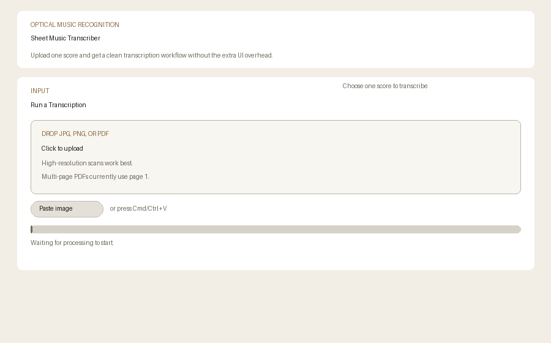
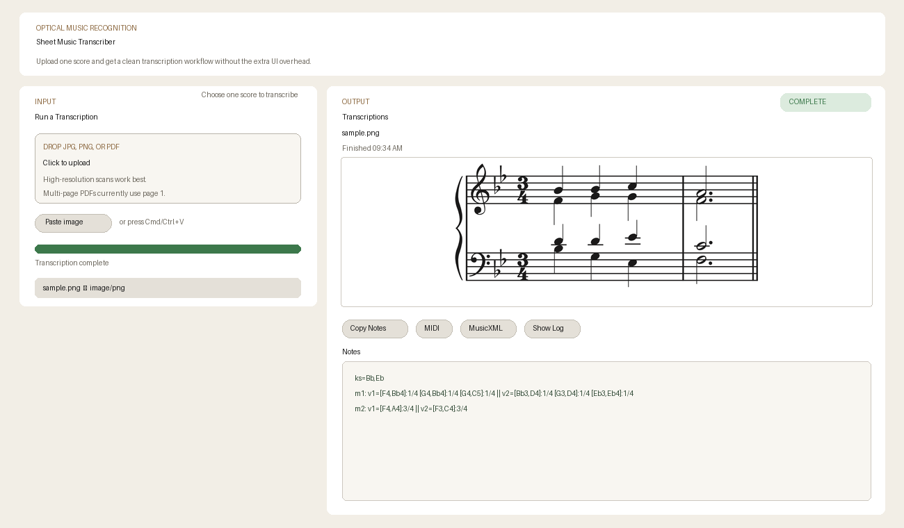

# Sheet Music Transcriber

A local web app that converts sheet music images into playable formats. Upload a photo or scan of sheet music and get back MIDI, MusicXML, and a plain text note list.

It runs entirely on your machine — no cloud, no accounts.

## Screenshots

<p float="left">
  
  
</p>

## How it works

When you upload a file, the app calls [homr](https://github.com/liebharc/homr) as a subprocess (`poetry run homr <image>`). homr runs an optical music recognition pipeline — staff line detection followed by neural network-based notehead and symbol classification — and outputs a MusicXML file. The app then uses [music21](https://web.mit.edu/music21/) to convert that MusicXML into MIDI and a compact plain-text note encoding.

The backend is a FastAPI server that manages job state and file downloads. The frontend is plain HTML/CSS/JS.

Supported input formats: JPG, PNG, PDF (first page only).

## Setup

**1. Install homr**

```bash
git clone https://github.com/liebharc/homr.git
cd homr
poetry install --only main
poetry run homr --init
```

By default the app looks for a sibling `../homr` checkout. If yours lives elsewhere, set the path:

```bash
export HOMR_DIR="/path/to/homr"
```

**2. Install dependencies**

```bash
pip install -r requirements.txt
```

You'll also need Poppler for PDF support:

```bash
# macOS
brew install poppler

# Linux
apt-get install poppler-utils
```

## Running

```bash
./start.sh
```

This starts the server and opens the app at `http://127.0.0.1:7860`.

## Notes

Recognition works best on clean, high-resolution printed sheet music. Handwritten or low-quality scans may produce poor results.
